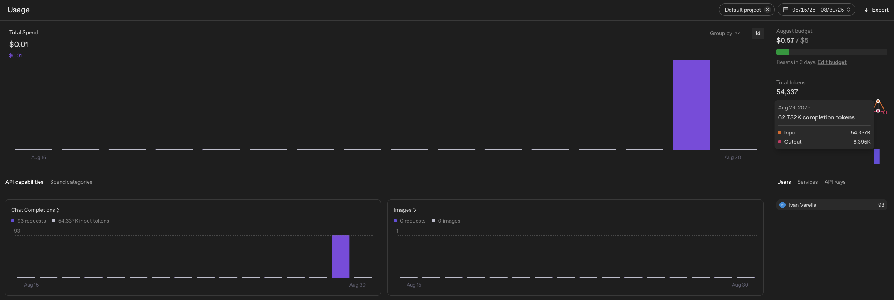

# DocETL - Análise de Documentos com IA

[](https://www.python.org/downloads/)
[](https://github.com/docetl/docetl)
[](https://openai.com/)
[](LICENSE)

## 📋 Sobre o Projeto

Este projeto demonstra o uso da biblioteca **DocETL** para análise inteligente de documentos jurídicos, especificamente a Lei Geral de Proteção de Dados (LGPD) do Brasil. O sistema utiliza **Docling** para extração automática de texto de PDFs e **DocETL** com processamento de linguagem natural com IA para extrair, analisar e resumir informações de documentos complexos de forma estruturada e temática.

### 🎯 Objetivos

- **Extração Automática**: Utilizar Docling para converter automaticamente PDFs em texto processável
- **Processamento Inteligente**: Utilizar IA para analisar documentos jurídicos extensos
- **Extração Estruturada**: Transformar texto não estruturado em dados organizados por tópicos
- **Automação de Análise**: Criar pipelines automatizados para processamento de documentos
- **Organização de Dados**: Manter estrutura organizada de arquivos de entrada e saída
- **Demonstração Prática**: Mostrar as capacidades da biblioteca DocETL em cenários reais

### 🚀 Funcionalidades Principais

- **Extração Inteligente de Documentos**: Conversão automática de PDFs para texto usando Docling
- **Organização Estruturada**: Separação automática de arquivos em pastas organizadas (PDFs e textos)
- **Split de Documentos**: Divisão automática de documentos longos em seções gerenciáveis
- **Análise com IA**: Processamento individual de cada seção usando GPT-4o-mini
- **Agrupamento Inteligente**: Consolidação de informações por tópicos relacionados
- **Resumo Automático**: Geração de sumários temáticos consolidados
- **Cache Inteligente**: Sistema de cache para otimização de custos e performance

## 🛠️ Tecnologias Utilizadas

### Core Technologies

- **Python 3.8+** - Linguagem principal
- **DocETL 0.2.5** - Biblioteca de processamento de documentos
- **Docling 2.29.0** - Biblioteca para extração e conversão de documentos (PDF, DOCX, HTML)
- **OpenAI GPT-4o-mini** - Modelo de IA para análise de texto
- **PyYAML 6.0.2** - Configuração de pipelines

### Dependencies Principais

- **Docling 2.29.0** - Extração e conversão de documentos
- **PyMuPDF 1.26.4** - Processamento de PDFs
- **Pandas 2.3.2** - Manipulação de dados
- **NumPy 2.3.2** - Computação numérica
- **Scikit-learn 1.7.1** - Machine Learning
- **Rich 14.1.0** - Interface de terminal rica

### APIs e Serviços

- **OpenAI API** - Processamento de linguagem natural
- **Azure Document Intelligence** - OCR e extração de texto (opcional)
- **Hugging Face Hub** - Modelos de IA alternativos

## 📦 Instalação

### Pré-requisitos

- Python 3.8 ou superior
- pip (gerenciador de pacotes Python)
- Chave de API da OpenAI

### 1. Clone o Repositório

```bash
# Via HTTPS
git clone https://github.com/ivanvarella/docetl.git
cd docetl

# Via SSH
git clone git@github.com:ivanvarella/docetl.git
cd docetl
```

### 2. Crie um Ambiente Virtual

#### **Linux/macOS:**

```bash
# Usando uv (recomendado - mais rápido)
uv venv docetl_env
source docetl_env/bin/activate

# Usando venv tradicional
python -m venv docetl_env
source docetl_env/bin/activate
```

#### **Windows:**

```cmd
# Usando uv (recomendado - mais rápido)
uv venv docetl_env
docetl_env\Scripts\activate

# Usando venv tradicional
python -m venv docetl_env
docetl_env\Scripts\activate
```

### 3. Instale as Dependências

#### **Linux/macOS:**

```bash
# Com uv (recomendado)
uv pip install -r requirements.txt

# Com pip tradicional
pip install -r requirements.txt
```

#### **Windows:**

```cmd
# Com uv (recomendado)
uv pip install -r requirements.txt

# Com pip tradicional
pip install -r requirements.txt
```

### 4. Configure as Variáveis de Ambiente

#### **Linux/macOS:**

```bash
# Copie o arquivo de exemplo
cp .env_exemple .env

# Edite o arquivo .env com sua chave da OpenAI
nano .env
# ou
code .env
```

#### **Windows:**

```cmd
# Copie o arquivo de exemplo
copy .env_exemple .env

# Edite o arquivo .env com sua chave da OpenAI
notepad .env
# ou
code .env
```

**Conteúdo do arquivo .env:**

```env
OPENAI_API_KEY=sua_chave_api_aqui
```

### 5. Verifique a Instalação

#### **Linux/macOS:**

```bash
docetl version
```

#### **Windows:**

```cmd
docetl version
```

## 🚀 Como Usar

### 🔄 **Novo Fluxo de Trabalho com Docling**

O projeto agora utiliza um **fluxo automatizado e organizado** para processamento de documentos:

1. **📁 Organização Automática de Arquivos:**

   - **Entrada:** PDFs são colocados na pasta `dados_fonte/pdfs/`
   - **Processamento:** O script `make_dataset_docling.py` extrai automaticamente o texto usando Docling
   - **Saída Organizada:** Textos extraídos são salvos em `dados_fonte/textos/`
   - **Dataset Final:** JSON é gerado na raiz do projeto para uso pelo DocETL

2. **🔄 Processamento Automatizado:**
   - **Extração:** Docling converte PDFs para texto com alta precisão
   - **Estruturação:** Script organiza automaticamente os arquivos
   - **Integração:** Dataset JSON é gerado no formato correto para o DocETL

### Execução Básica

#### **Linux/macOS:**

1. **Prepare o Dataset (o arquivo já está preparado, testar com outro arquivo, neste caso faça as alterações necessárias no script antes de executa-lo)**

```bash
# O script agora automatiza todo o processo:
# - Extrai texto do PDF usando Docling
# - Organiza arquivos em pastas estruturadas
# - Gera o dataset JSON automaticamente
python make_dataset_docling.py
```

2. **Execute o Pipeline**

```bash
docetl run pipeline.yaml
```

3. **Verifique os Resultados (os arquivos também já estão gerados)**

```bash
# Resultados finais
cat lgpd_summary_by_topic.json

# Resultados intermediários
ls intermediate_results/
```

#### **Windows:**

1. **Prepare o Dataset (o arquivo já está preparado, testar com outro arquivo, neste caso faça as alterações necessárias no script antes de executa-lo)**

```cmd
# O script agora automatiza todo o processo:
# - Extrai texto do PDF usando Docling
# - Organiza arquivos em pastas estruturadas
# - Gera o dataset JSON automaticamente
python make_dataset_docling.py
```

2. **Execute o Pipeline**

```cmd
docetl run pipeline.yaml
```

3. **Verifique os Resultados (os arquivos também já estão gerados)**

```cmd
# Resultados finais
type lgpd_summary_by_topic.json

# Resultados intermediários
dir intermediate_results\
```

### Estrutura do Pipeline

O projeto utiliza um pipeline de 3 etapas principais:

1. **Split** (`split_law_by_article`): Divide o documento em artigos individuais
2. **Map** (`analyze_article`): Analisa cada artigo com IA
3. **Reduce** (`summarize_by_topic`): Agrupa e consolida por tópicos

### Configuração Personalizada

Edite o arquivo `pipeline.yaml` para:

- Alterar o modelo de IA
- Modificar prompts de análise
- Ajustar parâmetros de processamento
- Adicionar novas operações

### 🆕 **Vantagens do Novo Sistema com Docling**

- **🔄 Automação Completa:** Não é mais necessário extrair manualmente texto de PDFs
- **📁 Organização Estruturada:** Arquivos são automaticamente organizados em pastas lógicas
- **🔧 Flexibilidade:** Fácil troca de PDFs de entrada - apenas coloque na pasta `dados_fonte/pdfs/`
- **📊 Integração Perfeita:** Dataset JSON é gerado automaticamente no formato correto para o DocETL
- **⚡ Eficiência:** Processo de extração e preparação é feito em uma única execução
- **🛡️ Robustez:** Tratamento de erros e validações automáticas em cada etapa

## 📊 Estrutura do Projeto

```
.
├── 📄 converter_utf8.py         # Utilitário para correção de codificação UTF-8
├── 📁 dados_fonte/              # Pasta organizada com PDFs e textos extraídos
│   ├── 📁 pdfs/                 # PDFs de entrada para processamento
│   │   └── L13709compilado.pdf  # PDF da Lei Geral de Proteção de Dados (LGPD)
│   └── 📁 textos/               # Arquivos de texto extraídos automaticamente
│       └── L13709compilado.pdf_TEXT.txt # Texto extraído do PDF pela biblioteca Docling
├── 📁 intermediate_results/      # Resultados intermediários do pipeline DocETL
│   ├── 📁 law_analysis_step/    # Resultados da etapa de análise dos artigos
│   │   ├── analyze_article.json # Análises individuais de cada artigo da LGPD
│   │   └── split_law_by_article.json # Divisão do documento em artigos individuais
│   └── 📁 topic_summary_step/   # Resultados da etapa de resumo por tópicos
│       └── summarize_by_topic.json # Resumos consolidados por grupos temáticos
├── 📄 lgpd_dataset.json         # Dataset de entrada processado para o pipeline DocETL
├── 📄 lgpd_summary_by_topic.json # Resultado final do pipeline com resumos temáticos
├── 📄 make_dataset_docling.py   # Script principal que automatiza extração com Docling e geração do dataset
├── 📄 pipeline.yaml             # Configuração do pipeline DocETL em formato YAML
├── 📄 .env_exemple              # Arquivo de exemplo para configuração de variáveis de ambiente
├── 📄 README.md                 # Documentação completa do projeto
├── 📄 Relatório_DocETL.pdf      # Relatório técnico detalhado da análise da LGPD
├── 📄 requirements.txt          # Lista de dependências Python do projeto
└── 📄 tree.txt                  # Estrutura de diretórios do projeto
```

### 📋 **Descrição Detalhada dos Arquivos**

#### 🔧 **Scripts e Utilitários**

- **`make_dataset_docling.py`**: Script principal que automatiza todo o processo de extração de dados. Utiliza a biblioteca Docling para converter PDFs em texto, organiza arquivos em pastas estruturadas, e gera automaticamente o dataset JSON no formato correto para o DocETL.

- **`converter_utf8.py`**: Utilitário para correção de codificação de caracteres. Resolve problemas de visualização de acentos e caracteres especiais em arquivos JSON, convertendo-os para UTF-8 adequado.

#### 📁 **Pasta dados_fonte/**

- **`dados_fonte/pdfs/`**: Contém os PDFs de entrada para processamento. Atualmente contém o arquivo da LGPD, mas pode ser facilmente expandido para outros documentos.

- **`dados_fonte/textos/`**: Armazena automaticamente os textos extraídos dos PDFs. Os arquivos são nomeados seguindo o padrão `[nome_original]_TEXT.txt`.

#### 📊 **Resultados do Pipeline**

- **`lgpd_dataset.json`**: Dataset de entrada para o pipeline DocETL. Contém o texto extraído da LGPD no formato estruturado esperado pela biblioteca.

- **`lgpd_summary_by_topic.json`**: Resultado final do pipeline, contendo resumos temáticos consolidados da LGPD. Organiza as informações por 36 tópicos principais identificados automaticamente.

- **`intermediate_results/`**: Diretório criado automaticamente pelo DocETL que armazena resultados intermediários de cada operação, facilitando depuração e análise do processo.

#### ⚙️ **Configuração e Documentação**

- **`pipeline.yaml`**: Arquivo de configuração declarativa que define todo o fluxo de trabalho do DocETL. Especifica operações de split, map e reduce para processamento da LGPD.

- **`.env_exemple`**: Template para configuração de variáveis de ambiente, incluindo chaves de API necessárias para o funcionamento do sistema.

- **`requirements.txt`**: Lista completa de dependências Python com versões específicas, incluindo Docling 2.29.0, DocETL e outras bibliotecas necessárias.

- **`README.md`**: Documentação completa do projeto, incluindo instruções de instalação, uso e explicação detalhada do fluxo de trabalho.

- **`Relatório_DocETL.pdf`**: Relatório técnico detalhado documentando todo o processo de análise da LGPD, incluindo metodologia, resultados e reflexões sobre o uso da biblioteca DocETL.

- **`tree.txt`**: Representação textual da estrutura de diretórios do projeto para referência rápida.

## 🔧 Configuração Avançada

### Otimização de Performance

#### **Linux/macOS:**

```bash
# Usar otimizador automático
docetl build pipeline.yaml

# Executar com cache limpo
docetl run pipeline.yaml --clear-cache
```

#### **Windows:**

```cmd
# Usar otimizador automático
docetl build pipeline.yaml

# Executar com cache limpo
docetl run pipeline.yaml --clear-cache
```

### Logs e Debugging

#### **Linux/macOS:**

```bash
# Execução com logs detalhados
docetl run pipeline.yaml --verbose

# Verificar status do cache
docetl cache status
```

#### **Windows:**

```cmd
# Execução com logs detalhados
docetl run pipeline.yaml --verbose

# Verificar status do cache
docetl cache status
```

### Personalização de Modelos

Edite o `pipeline.yaml` para usar diferentes modelos:

```yaml
default_model: gpt-4o-mini # ou gpt-4, gpt-3.5-turbo, etc.
```

## 📈 Métricas e Performance

### Estatísticas de Execução

- **Documentos Processados**: 57 artigos da LGPD
- **Tópicos Identificados**: 36 grupos temáticos
- **Chamadas à API**: 93 total (57 map + 36 reduce)
- **Tokens Consumidos**: 62.732 (54.337 input + 8.395 output)
- **Custo Estimado**: ~$0.01 por execução completa

### Otimizações Implementadas

- **Sistema de Cache**: Reutilização de resultados processados
- **Processamento em Lotes**: Agrupamento eficiente de operações
- **Validação de Schema**: Estrutura de dados consistente

## 📝 Licença

Este projeto está sob a licença MIT. Veja o arquivo [LICENSE](LICENSE) para mais detalhes.

</br></br></br></br>

---

# Relatório de Análise da LGPD com a Biblioteca DocETL

**Data:** 29 de agosto de 2025
**Responsável:** Ivan Varella
**Projeto:** Teste da biblioteca DocETL para análise de texto jurídico (Lei Geral de Proteção de Dados - LGPD).

## 1. Introdução

Este relatório documenta o processo de utilização da biblioteca de processamento de documentos `DocETL` para realizar uma análise estruturada e temática da Lei Geral de Proteção de Dados do Brasil (LGPD, LEI Nº 13.709). O objetivo foi testar as capacidades da biblioteca em um cenário real e complexo, transformando um longo e denso texto jurídico em um sumário organizado por temas.

O projeto partiu de uma configuração inicial robusta. Primeiramente, o texto da lei foi extraído de seu arquivo PDF original utilizando a biblioteca `Docling` através do script `make_dataset_docling.py`. Este script automatiza todo o processo: extrai o texto do PDF, salva na pasta organizada `dados_fonte/textos/`, e gera automaticamente o arquivo de dataset `lgpd_dataset.json` no formato esperado pela biblioteca `DocETL`. A partir deste ponto, com o ambiente Python devidamente configurado com as chaves de API da OpenAI, a metodologia adotada envolveu a criação iterativa de um pipeline em YAML, com depuração e análise dos resultados a cada passo.

## 2. Metodologia e Execução do Pipeline

Para atingir o objetivo, foi desenhado um pipeline de múltiplas etapas, aproveitando os principais operadores da DocETL para decompor a tarefa complexa.

### Arquitetura do Pipeline: `Split -> Map -> Reduce`

O pipeline foi estruturado em três operações lógicas principais, orquestradas em dois passos sequenciais:

1. **Operação `split_law_by_article` (Split):**
   - **Objetivo:** Dividir o texto monolítico da LGPD em unidades de análise menores e mais gerenciáveis.
   - **Execução:** Utilizou-se o delimitador `"- Art."` para quebrar o documento original. Esta ação resultou em **57 chunks**, cada um correspondendo a um artigo ou parágrafo da lei.
2. **Operação `analyze_article` (Map):**
   - **Objetivo:** Analisar cada um dos 57 chunks individualmente para extrair informações estruturadas.
   - **Execução:** Para cada chunk, foi feita uma chamada à API da OpenAI (modelo `gpt-4o-mini`). O prompt instruiu o modelo a identificar o **tópico principal** do artigo e a gerar um **resumo conciso** de seu conteúdo.
3. **Operação `summarize_by_topic` (Reduce):**
   - **Objetivo:** Agrupar os artigos analisados por tema e criar um resumo consolidado para cada um.
   - **Execução:** A operação utilizou a chave `topic` (gerada na etapa anterior) para agrupar os 57 itens. Isso resultou em **36 grupos de tópicos únicos**. Para cada grupo, uma nova chamada à API foi realizada, solicitando a síntese de todos os resumos individuais em um parágrafo final coeso.

### Dataset de Entrada (`lgpd_dataset.json`)

O ponto de partida para o pipeline foi um arquivo JSON simples, contendo um único objeto com uma chave `"src"`. O valor dessa chave era o texto completo da LGPD, previamente extraído e limpo. A estrutura é exemplificada abaixo:

```
[
  {
    "src": "## Mensagem de veto\n\n## Vigência\n\n## Presidência da República\n\n## Secretaria-Geral Subchefia para Assuntos Jurídicos\n\n## LEI Nº 13.709, DE 14 DE AGOSTO DE 2018\n\nLei Geral de Proteção de Dados Pessoais (LGPD).    (Redação dada pela Lei nº 13.853, de 2019) Vigência\n\nO PRESIDENTE DA REPÚBLICA Faço saber que o Congresso Nacional decreta e eu sanciono a seguinte Lei:\n\n## CAPÍTULO I DISPOSIÇÕES PRELIMINARES\n\n- Art. 1º Esta Lei dispõe sobre o tratamento de dados pessoais, inclusive nos meios digitais, por pessoa natural ou por pessoa jurídica de direito público ou privado, com o objetivo de proteger os direitos fundamentais de liberdade e de privacidade e o livre desenvolvimento da personalidade da pessoa natural.\n\n[... restante do texto da lei ...]"
  }
]

```

### Configuração do Pipeline (`pipeline.yaml`)

Todo o fluxo de trabalho foi definido no arquivo `pipeline.yaml`. Este arquivo declarativo instrui o DocETL sobre quais dados usar, quais operações executar e em que ordem. O conteúdo completo utilizado foi:

```
datasets:
  lgpd_dataset:
    type: file
    path: "lgpd_dataset.json"

default_model: gpt-4o-mini
system_prompt:
  dataset_description: "O conteúdo da Lei Geral de Proteção de Dados do Brasil (LGPD - LEI Nº 13.709)."
  persona: "Um assistente jurídico especialista em legislação brasileira, focado em análise e síntese de textos legais."

operations:
  - name: split_law_by_article
    type: split
    split_key: src
    method: delimiter
    method_kwargs:
      delimiter: "- Art."
      num_splits_to_group: 1

  - name: analyze_article
    type: map
    prompt: |
      Analise o seguinte trecho da Lei Geral de Proteção de Dados (LGPD) do Brasil:
      "{{ input.src_chunk }}"

      Com base no texto, forneça as seguintes informações:
      1.  **Tópico Principal**: Identifique e retorne o tema central deste artigo (ex: "Princípios", "Direitos do Titular", "Bases Legais", "Tratamento de Dados Sensíveis", "Sanções Administrativas", "Transferência Internacional de Dados", "Agentes de Tratamento").
      2.  **Resumo**: Crie um resumo conciso (1-2 sentenças) explicando o propósito principal deste artigo.
    output:
      schema:
        topic: "string"
        summary: "string"

  - name: summarize_by_topic
    type: reduce
    reduce_key: topic
    prompt: |
      Você recebeu vários artigos da LGPD que tratam sobre o mesmo tópico: "{{ reduce_key }}".

      Abaixo estão os resumos de cada artigo relacionado a este tópico:
      
      - Artigo: {{ item.summary }}
      

      Sintetize todas essas informações em um parágrafo coeso e abrangente que explique como a LGPD aborda o tópico de "{{ reduce_key }}".
    output:
      schema:
        topic_summary: "string"

pipeline:
  steps:
    - name: law_analysis_step
      input: lgpd_dataset
      operations:
        - split_law_by_article
        - analyze_article

    - name: topic_summary_step
      input: law_analysis_step
      operations:
        - summarize_by_topic

  output:
    type: file
    path: "lgpd_summary_by_topic.json"
    intermediate_dir: "intermediate_results"

```

### Estrutura de Arquivos do Projeto

A execução do pipeline e os scripts de preparação resultaram na seguinte estrutura de arquivos e diretórios na raiz do projeto:

```
.
├── converter_utf8.py
├── intermediate_results/
│   ├── law_analysis_step/
│   │   ├── analyze_article.json
│   │   └── split_law_by_article.json
│   └── topic_summary_step/
│       └── summarize_by_topic.json
├── dados_fonte/
│   ├── pdfs/
│   │   └── L13709compilado.pdf
│   └── textos/
│       └── L13709compilado_TEXT.txt
├── lgpd_dataset.json
├── lgpd_summary_by_topic.json
├── make_dataset_docling.py
└── pipeline.yaml

```

- **`pipeline.yaml`**: Arquivo de configuração que define todas as etapas e operações do pipeline do DocETL.
- **`make_dataset_docling.py`**: Script principal que utiliza Docling para extrair texto de PDFs e gerar o dataset JSON.
- **`converter_utf8.py`**: Script utilitário para corrigir a codificação de caracteres do arquivo de saída.
- **`dados_fonte/`**: Pasta organizada contendo PDFs de entrada e textos extraídos automaticamente.
- **`lgpd_dataset.json`**: Dataset de entrada para o pipeline, formatado na estrutura correta.
- **`intermediate_results/`**: Diretório criado automaticamente pelo DocETL para armazenar os resultados de cada operação, facilitando a depuração.
- **`lgpd_summary_by_topic.json`**: O arquivo final, contendo o resumo temático da LGPD.

## 3. Análise dos Resultados

O pipeline foi executado com sucesso, gerando o arquivo `lgpd_summary_by_topic.json`. A análise do conteúdo revelou os seguintes pontos:

### Pontos Positivos

- **Qualidade da Sumarização:** O resultado final é um sumário temático de alta qualidade da LGPD. Os tópicos extraídos são pertinentes e os resumos são precisos e bem escritos, demonstrando a eficácia do pipeline.
- **Eficácia do Agrupamento:** O campo `_counts_prereduce_summarize_by_topic`, adicionado pelo DocETL, confirmou o sucesso do agrupamento. Por exemplo:
  - O tópico **"Agentes de Tratamento"** consolidou informações de **12 artigos** diferentes.
  - O tópico **"Direitos do Titular"** agrupou **5 artigos**.
  - Isso mostra que o pipeline conseguiu identificar e agrupar com sucesso conteúdo relacionado disperso ao longo da lei.

### Pontos de Melhoria Identificados

A análise também revelou uma oportunidade clara de refinamento, causada pela variabilidade natural da geração de texto por LLMs:

- **Redundância de Tópicos:** Foram identificados tópicos semanticamente idênticos, mas textualmente diferentes. Por exemplo:
  - `"Regras de Boas Práticas e Governança em Proteção de Dados"` vs. `"Boas Práticas e Governança"`
  - `"Tratamento de Dados Pessoais pelo Poder Público"` vs. `"Tratamento de Dados pelo Poder Público"`

Isso fez com que o operador `reduce` os tratasse como grupos distintos, fragmentando o que deveria ser um único resumo consolidado.

## 4. Análise da Execução e Logs

A análise dos logs do terminal foi crucial para depurar e entender o comportamento do DocETL.

### Custo de Execução

- **Observação:** O log da execução final bem-sucedida reportou um custo de `$0.00`.
- **Análise:** Isso não significa que a API não foi usada. O custo de **$0.01** foi, na verdade, incorrido na primeira tentativa de execução para a operação de `map` (processando os 57 chunks). Como o **mecanismo de cache do DocETL** funcionou perfeitamente, na segunda tentativa ele reutilizou os resultados já processados, e executou apenas a etapa de `reduce`, cujo custo foi baixo o suficiente para ser arredondado para zero. Isso confirma que o pipeline está corretamente configurado para usar a API, mas de forma eficiente.

### Detalhes das Chamadas à API e Consumo de Tokens

A execução completa do pipeline (considerando um cache vazio) foi confirmada como tendo realizado um total de **93 chamadas à API** da OpenAI. Essa atividade resultou em um consumo total de **62.732 tokens**, divididos em **54.337 tokens de entrada (input)** e **8.395 tokens de saída (output)**.

Essa distribuição de tokens e chamadas pode ser explicada da seguinte forma:

- **57 Chamadas na Etapa `Map`:** A operação `analyze_article` processou cada um dos **57 chunks** de texto. Para cada chamada, os tokens de entrada consistiram no texto do artigo da lei mais as instruções do prompt. Os tokens de saída foram o JSON estruturado com o tópico e o resumo. Esta etapa foi responsável pela maior parte dos tokens de entrada.
- **36 Chamadas na Etapa `Reduce`:** A operação `summarize_by_topic` foi executada para cada um dos **36 tópicos únicos** identificados. Para cada chamada, os tokens de entrada foram os resumos dos artigos daquele tópico mais as instruções do prompt de síntese. Os tokens de saída foram o parágrafo final consolidado.



Imagem do Dashboard de gerenciamento da API OpenAI

### Codificação de Caracteres

- **Observação:** O arquivo JSON inicial apresentava caracteres acentuados no formato de escape Unicode (ex: `Prote\u00e7\u00e3o`).
- **Análise:** O problema de visualização dos caracteres foi solucionado com a utilização de um simples script para gravar novamente o arquivo de resultado, especificando a codificação correta (`UTF-8`). Isso corrigiu a representação dos caracteres especiais, resolvendo os problemas de codificação.

### Métricas de Execução (57 vs. 36)

- **`57/57` (Map):** Corresponde ao número total de **chunks (artigos)** gerados pela operação `split` e processados individualmente pela operação `map`.
- **`36/36` (Reduce):** Corresponde ao número de **tópicos únicos** que foram identificados na etapa de `map`. A operação `reduce` então processou cada um desses 36 grupos.

## 5. Conclusão

O experimento foi um **sucesso**. Demonstrou-se que a biblioteca DocETL é uma ferramenta poderosa e adequada para tarefas complexas de processamento de documentos. O pipeline `Split -> Map -> Reduce` foi capaz de transformar com sucesso um documento não estruturado em um sumário temático e organizado. A análise detalhada dos logs e dos resultados não só validou a eficácia do processo, mas também revelou oportunidades claras para otimização e aprofundamento da análise.

## 6. Reflexões sobre a Ferramenta DocETL

Este teste prático permitiu uma avaliação aprofundada da biblioteca DocETL, revelando seus pontos fortes e desafios.

- **Pontos Fortes:**
  - **Modularidade:** A abordagem baseada em operadores (`split`, `map`, `reduce`) é intuitiva e poderosa, permitindo quebrar problemas complexos em etapas lógicas e gerenciáveis.
  - **Cache Inteligente:** O sistema de cache é um dos recursos mais impactantes, economizando significativamente tempo e custos de API durante o desenvolvimento e a depuração iterativa do pipeline.
  - **Interface Declarativa:** O uso de YAML para definir o pipeline torna a configuração clara, legível e fácil de versionar, sem a necessidade de escrever código complexo para orquestração.
- **Desafios e Aprendizados:**
  - **Curva de Aprendizagem da Sintaxe:** A sintaxe do YAML, especialmente na estruturação de passos (`steps`) e saídas (`output`), requer atenção aos detalhes, como visto nos erros iniciais de parsing.
  - **Gerenciamento de Saída:** A codificação de caracteres do arquivo de saída JSON precisou de uma intervenção externa, indicando uma área onde a ferramenta poderia oferecer mais controle direto.

## 7. Próximos Passos e Futuras Otimizações

Para refinar ainda mais os resultados e explorar todo o potencial da ferramenta, os seguintes passos são recomendados:

### 7.1. Implementação do Operador `resolve`

Para solucionar a redundância de tópicos, a próxima iteração do pipeline deve incluir o operador `resolve` para unificar tópicos semanticamente equivalentes.

- **Nova Arquitetura:** `Split -> Map -> **Resolve** -> Reduce`
- **Exemplo de Operação `resolve`:**

```
# A ser inserido na seção 'operations' do pipeline.yaml

- name: resolve_topics
  type: resolve
  blocking_keys: # Ajuda a comparar apenas tópicos que já são textualmente parecidos
    - topic
  comparison_prompt: |
    Compare os dois tópicos da LGPD abaixo:
    Tópico 1: "{{ input1.topic }}"
    Tópico 2: "{{ input2.topic }}"
    Eles representam o mesmo conceito fundamental? Responda apenas com "True" ou "False".
  resolution_prompt: |
    A partir da lista de tópicos duplicados abaixo, escolha o nome mais claro e conciso para representar o grupo:
    
    - {{ entry.topic }}
    
  output:
    schema:
      topic: "string" # O novo nome canônico do tópico

```

### 7.2. Exploração de Análises Mais Profundas

Com a base temática estabelecida, o pipeline pode ser estendido para extrair informações mais granulares, como:

- **Extração de Entidades:** Modificar a operação `map` para extrair entidades específicas como prazos (ex: "72 horas"), valores de multas, ou as responsabilidades exatas do Encarregado (DPO).
- **Análise de Sentimento:** Embora menos aplicável a um texto de lei, em outros documentos jurídicos (como petições ou sentenças), uma análise de sentimento por cláusula poderia ser útil.

### 7.3. Uso do Otimizador (`docetl build`)

Uma abordagem alternativa à criação manual do operador `resolve` seria utilizar o otimizador do DocETL. Executando `docetl build pipeline.yaml`, a ferramenta poderia analisar a relação entre o `map` e o `reduce` e **sintetizar automaticamente** uma operação `resolve` otimizada, incluindo a configuração de `blocking_thresholds` para maior eficiência.
